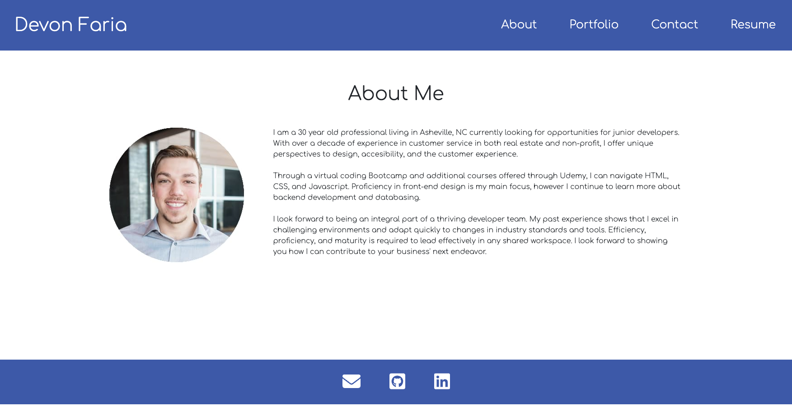
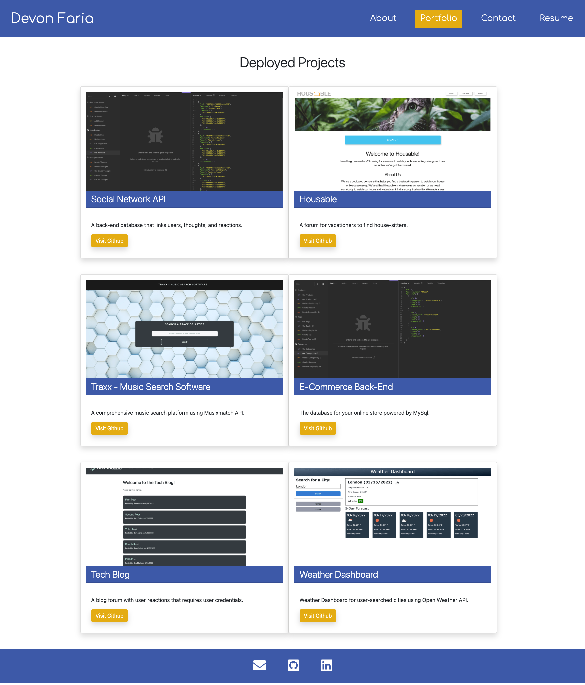
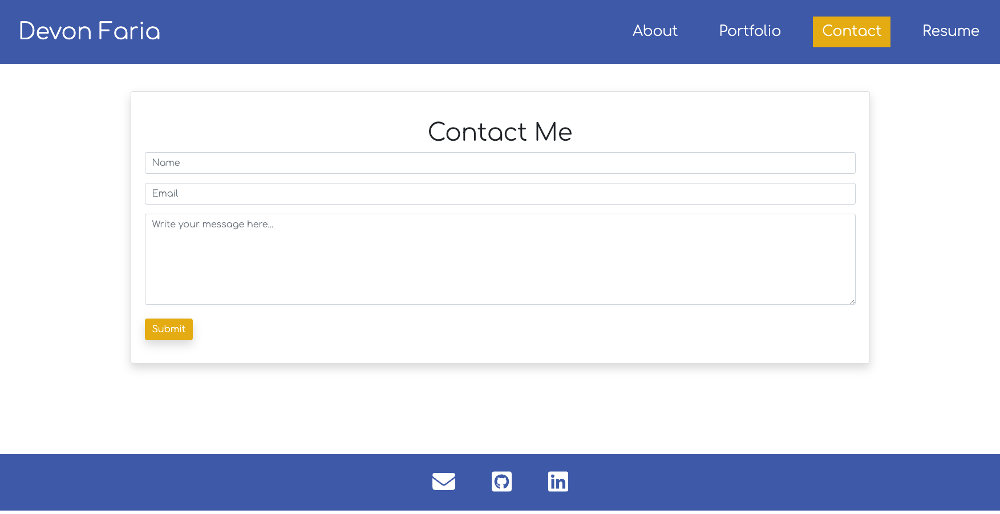
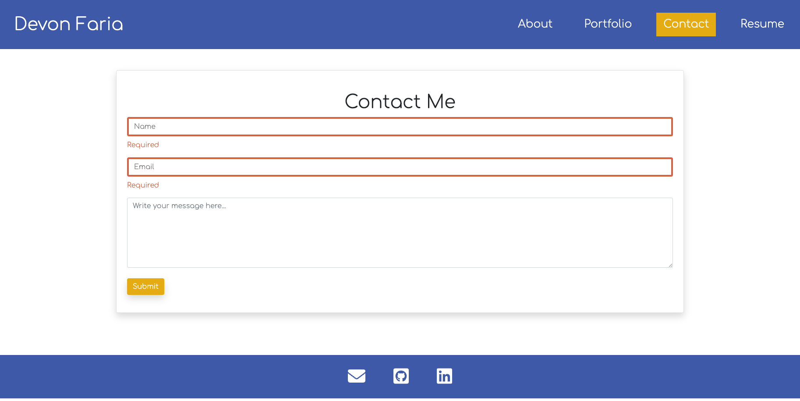

# React Professional Portfolio

[Link to deployed application](https://devonfaria.github.io/react-portfolio/)

## Table of Contents

* [Description](#description)
* [Visuals](#visuals)
* [Technologies](#technologies)
* [Licenses](#licenses)
* [Support](#support)
* [Authors](#authors)
* [Contributions](#contributions)

## Description

Welcome to my Web Developer Portfolio, powered by React. This site uses React components to dynamically build the website so that it does not reload when visiting each subpages content. Additionally, the page accepts messages from a contact form that will later feed into a database on the backend. 

Additional features include linked icons to GitHub, LinkedIn, and email from the footer, and a linked resume that opens in a new tab. Other functionalities include is to inform the user that the field is required if left blank in the contact form, and validating emails for valid syntax once submitted.

## Visuals

This is the About Me landing page for the portfolio, with tabs to navigate to the subpages without reloading, and footer icons that link to Github, LinkedIn, and email. 

This is the projects page, showing six applications with links to their deployed applications(if possible), and the cooresponding Github repositories. 

This is the Contact page, where users will be informed if a required field is left blank, and email entries will be validated for proper syntax on submit. 

Example of the fields highlighting they are required when left blank. 

[Link to deployed application](https://devonfaria.github.io/react-portfolio/)

## Technologies

* Node JS
* Express
* React
* DotEnv
* Axios
* Cloudinary
* Bootstrap
* FontAwesome

## Licenses

This application uses the MIT Software License. [Click here to view full license.](LICENSE)

## Support

Contact us at devonfaria@gmail.com if you need assistance downloading or activating this repository. You can also find me on [GitHub.](https://github.com/devonfaria)

## Authors

Devon Faria

## Contributions

Thank you to Anthony Cooper and Sasha Peters for always helping me out when I am not grasping a subject.